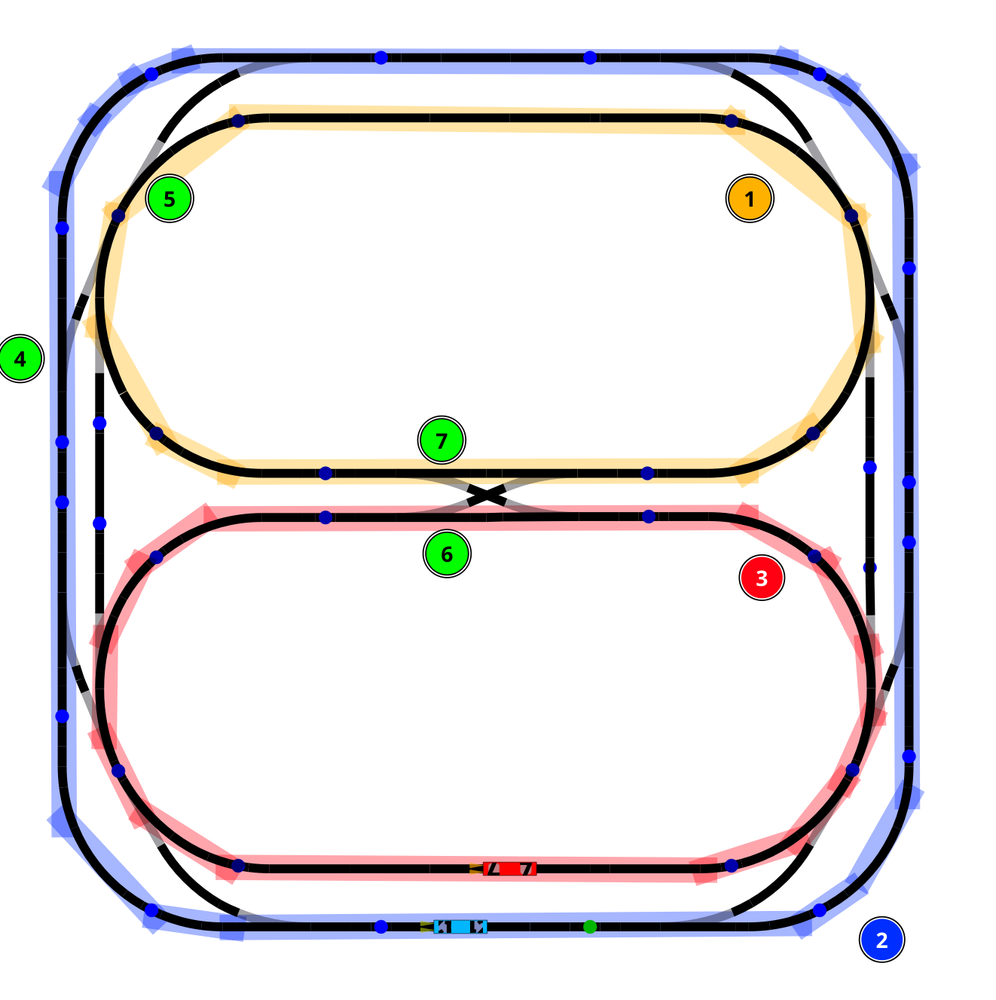

# Conceptualisation

1. Section partagee entre les 2 trains
2. Section pour le train bleu
3. Section pour le train rouge
4. Aiguillage d'entree a la section partagee pour le train bleu (16)
5. Aiguillage de sortie de la section partagee pour le train bleu (14)
6. Aiguillage d'entree a la section partagee pour le train rouge (24)
7. Aiguillage de sortie de la section partagee pour le train rouge (18)

# Implementation de sharedsection 

## attribute liste : 
* sem : sémaphore utilisé pour réveiller une loco en attente.

* mutex : protège l’accès aux variables partagées.

* blocked : vrai si la section est occupée.

* iswaiting : vrai si au moins une loco attend.

* _loco : la loco enregistrée pour vérifier certaines erreurs.

* _d : direction de la loco dans la section.

* nberrors : compteur d’erreurs détectées dans la logique.

## méthode : 

### access :

La méthode vérifie si la section est libre et mémorise la locomotive qui y entre.

Elle incrémente un compteur d’erreurs si la même loco tente d’entrer plusieurs fois.

Elle prend le mutex pour protéger l’accès aux variables partagées.

Si la section est déjà occupée, la loco s’arrête et attend sur le sémaphore.

Sinon, elle démarre, marque la section comme bloquée et enregistre sa direction.

### leave :

La méthode signale que la locomotive a quitté la section.

Elle vérifie si la direction fournie correspond à celle enregistrée. Si la direction est incorrecte, elle incrémente le compteur d’erreurs.

Elle vérifie également si la locomotive quittant est celle enregistrée comme occupant. Si c’est le cas, cela ajoute aussi une erreur pour détecter un comportement anormal.

Normalement, devrait être toujours appeler avant release dans le code du parcours des threads.

### release : 

La méthode libère la section partagée pour qu’une nouvelle locomotive puisse entrer.

Elle prend le mutex pour protéger les variables partagées.

Elle met blocked à false pour indiquer que la section est libre.

Si une locomotive attendait, elle la réveille en libérant le sémaphore.

Elle relâche ensuite le mutex pour permettre à d’autres threads d’accéder à la section.

### StopAll :

Bloque tous si appeler avec le blocked.

### nbErrors :

Retourne le nombre d’erreurs enregistrées.

#Implementation de locomotiveBehavior :: RUN

##Initialisation de la locomotive :
La loco allume ses phares, démarre et affiche un message “Ready!”, ce qui prépare la loco pour le parcours.

Détermination de l’identité et de la direction :

On distingue les locomotives par leur numéro (loco.numero() == 7).

Chaque loco se voit attribuer une direction (D1 ou D2) dans la section partagée.
Cela permet à la section de savoir quelle locomotive arrive et dans quelle direction elle va circuler.

##Définition des points de contact :

contactAvantEntree : point avant lequel la loco doit potentiellement s’arrêter pour ne pas entrer dans la section occupée (prise en compte de l’inertie).

contactApresSortie : point après lequel la loco a complètement quitté la section.
Ces points permettent de déclencher correctement les méthodes access(), leave() et release() sur la section partagée.

##Boucle principale :

La loco attend d’atteindre le contact avant l’entrée.

Elle appelle sharedSection->access() pour demander l’accès à la section. Si la section est occupée, elle s’arrête avant d’entrer, grâce au mécanisme de access().

Elle traverse la section et attend d’atteindre le contact après la sortie.

Elle appelle sharedSection->leave() pour signaler qu’elle quitte la section et sharedSection->release() pour libérer la section pour l’autre locomotive.

##Stratégie derrière le design :

La section partagée est unique et ne nécessite pas de changer d’aiguillage.

Pour éviter les collisions, il suffit de contrôler l’accès à cette section et d’arrêter les trains avant d’y entrer si nécessaire.

Le sémaphore et le mutex de SharedSection garantissent qu’une seule loco occupe la section à la fois, sans risque de collision.

L’inertie est prise en compte en positionnant le contact d’arrêt avant l’entrée, assurant que la loco peut réellement s’arrêter à temps.

Cette stratégie est simple et efficace pour un scénario où le parcours est fixe et la section critique est courte : on bloque l’entrée plutôt que de gérer des aiguillages complexes.

# implementation de emergency_stop :

Ne fais que stopper les deux locomotives en même temps.
